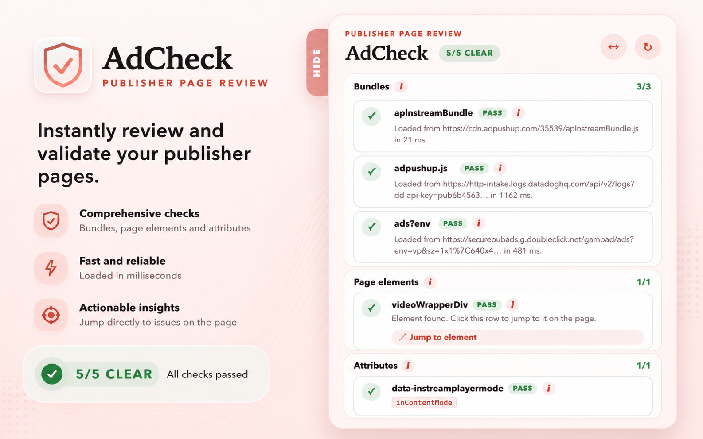

# AdCheck

[](https://ggl.link/adcheck?utm_source=github&utm_medium=readme)



AdCheck is a lightweight, framework-free Manifest V3 Chrome extension designed for ad operations and developers to validate ad tag implementations on publisher websites. It provides real-time visibility into network requests, DOM elements, and custom script behaviors.

## Documentation

Detailed documentation on AdCheck's features and capabilities is available on our GitHub Pages site (served from the `docs/` folder).

- [Features Overview](docs/index.md)
- [Side Panel Widget](docs/features/widget.md)
- [Configuration Settings](docs/features/settings.md)
- [Site Overrides & Global Actions](docs/features/site-overrides.md)

## Tech Stack

- **TypeScript**: Core logic and typed Chrome APIs.
- **Vanilla HTML/CSS/JS**: Lightweight footprint with no external frameworks.
- **Chrome Manifest V3**: Built for the latest extension standards.

## Installation & Development

### Prerequisites

- Node.js and npm

### Local Setup

1. Clone the repository.
2. Install dependencies:
   ```bash
   npm install
   ```

### Build Commands

- **Build Extension**: Compiles TypeScript and copies static assets to the `dist/` directory.
  ```bash
   npm run build
  ```
- **Typecheck**: Validate TypeScript types.
  ```bash
   npm run typecheck
  ```
- **Generate Icons**: Re-generate extension icons from source assets.
  ```bash
   npm run generate:icons
  ```

### Loading the Extension

1. Open Chrome and navigate to `chrome://extensions/`.
2. Enable **Developer mode** in the top right.
3. Click **Load unpacked** and select the `dist/` folder in this repository.

## Usage

- **Global Toggle**: Use the main toggle in the popup to enable or disable AdCheck globally.
- **Site Specifics**: Open the "Current site override" section to configure custom behaviors for a specific hostname.
- **Allow User Scripts**: For inline script overrides to function, ensure "Allow access to user scripts" is enabled in the extension details page in Chrome.

## License

This project is licensed under the [MIT License](LICENSE).

## Privacy Policy

Check out the [AdCheck Privacy Policy](PRIVACY.md) (or [docs/privacy.md](docs/privacy.md)) for more details.

_*धन्यवाद*_
